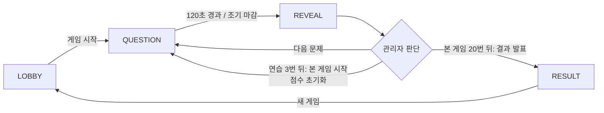

# ABC 광장 퀴즈 게임 기획서

Sep 29, 2026 · @정동묵

## 1. 개요

최대 15명이 각자 핸드폰 브라우저로 접속해, 타일 필드 위 캐릭터를 움직여 A·B·C 답안 원에 들어가 문제를 푸는 실시간 멀티플레이 퀴즈 게임이다. 연습게임 3문제로 규칙을 익힌 뒤 본 게임 20문제를 진행하고, 본 게임 총점이 가장 높은 플레이어가 승리한다.

| 항목 | 내용 |
| --- | --- |
| 플레이 인원 | 플레이어 최대 15명 + 관리자 1명(인원 제한에 미포함) |
| 플랫폼 | 모바일 웹 브라우저(가로 화면 기준), 앱 설치 없음 |
| 조작 | 화면 터치 지점으로 내 캐릭터가 이동 |
| 문제 구성 | 연습게임 3문제 → 본 게임 20문제 (총 23문제) |
| 문제 형식 | 3지선다(A/B/C), 정답 1개. 문제마다 주제(topic)가 있음 |
| 문제 노출 | 문제 텍스트는 관리자 화면에만 표시, 플레이어는 주제와 A·B·C 선택지만 봄. 관리자가 문제를 소리 내어 읽어 준다 |
| 제한 시간 | 문제당 2분(120초). 관리자가 「정답 바로 발표」로 앞당길 수 있음 |
| 기본 점수 | 정답 +10점, 오답·미제출 0점 |
| 부가 점수 | 문제마다 찍기 기술 1개 선택(맞힘·틀림 찍기 ±3점, 초기화). 이모티콘 5종은 점수와 무관하게 언제든 사용 |
| 연습게임 점수 | 점수 변동은 화면에 보여 주지만 본 게임 시작 때 모두 0점으로 초기화(최종 순위에 미반영) |
| 진행 | 관리자가 문제 시작·정답 발표·다음 문제·결과 발표를 결정 |
| 종료 | 본 게임 총점·순위를 롤링 애니메이션으로 발표 |

이 문서는 Claude Code 같은 코딩 에이전트(이하 Claude Agent)가 그대로 구현할 수 있도록 규칙, 상태, 이벤트, 문제 데이터, 인수 기준을 명시한다. 원본 요구사항에 없던 결정은 「가정」이라고 표시했으니 필요하면 수정한다.

## 2. 기술 스택 및 아키텍처

서버가 모든 상태(위치, 답 판정, 점수)를 결정하는 서버 권위(server-authoritative) 구조로 만든다. 클라이언트는 입력 전송과 화면 표시만 담당해 점수 조작을 막는다.

| 영역 | 권장 기술 | 비고 |
| --- | --- | --- |
| 언어 | TypeScript | 클라이언트·서버 타입 공유(`shared/` 폴더) |
| 서버 | Node.js 20 + Express + Socket.IO | 실시간 양방향 통신, 단일 방(room) 인메모리 상태 |
| 클라이언트 빌드 | Vite | 정적 파일을 Express가 서빙 |
| 필드 렌더링 | HTML5 Canvas 2D (또는 Phaser 3) | 타일·캐릭터·답안 원·말풍선 |
| UI(입장·모달·결과) | HTML/CSS 오버레이 | 캔버스 위에 DOM으로 얹음 |
| 문제 데이터 | `server/data/questions.json` | 13장 내용 그대로 |
| 배포 | Render 무료 플랜 Web Service 1개, 싱가포르 리전 | 카드 등록 없이 무료, WebSocket 지원. 서버·클라이언트를 한 서비스로 배포 |

모든 구성 요소가 무료 오픈소스이고, 배포도 Render 무료 플랜 하나로 끝나므로 개발·운영 비용은 0원이다. Railway와 Fly.io는 무료 플랜이 없어져 후보에서 뺐다.

Render 무료 플랜의 제약과 대응은 다음과 같다.

| 제약 | 영향 | 대응 |
| --- | --- | --- |
| 사양 512MB RAM, 0.1 CPU | 15명 규모에는 충분하나 CPU 여유가 작음 | 위치 브로드캐스트를 10Hz로 제한(5장) |
| 15분간 요청·WebSocket 메시지가 없으면 잠듦, 깨는 데 약 1분 | 행사 직전 첫 접속이 느림 | 행사 5분 전 관리자가 먼저 접속해 서버를 깨움(12장 운영 체크리스트). 대기실 대기는 15분 미만이라 게임 중에는 잠들지 않음 |
| 예고 없는 재시작 가능, 재시작 시 메모리·파일 초기화 | 게임 중 재시작되면 점수가 사라짐 | 관리자 화면의 「점수 백업」으로 라운드마다 점수를 내려받아 둠(11장) |

권장 폴더 구조는 다음과 같다.

```
/client        Vite 프론트엔드 (index.html, src/)
/server        Express + Socket.IO (index.ts, game/, data/questions.json)
/shared        이벤트 이름, 타입, 상수(필드 크기, 원 좌표, 점수)
/client/public/assets/characters   캐릭터 이미지 5종 (직접 넣음)
```

## 3. 화면 구성과 사용자 흐름

플레이어는 입장 → 대기실 → 게임 → 결과 순서로 4개 화면을 지난다. 관리자는 별도 주소(`/admin`)로 들어와 같은 필드를 보면서 진행 버튼을 가진다.

1. **입장 화면** (`/`): 캐릭터 5종 중 1개 선택 + 닉네임 입력 → 「입장하기」 버튼.
2. **대기실**: 필드가 바로 보이고 자유롭게 이동 가능. 상단에 「관리자가 게임을 시작하길 기다리는 중 (현재 N/15명)」 표시.
3. **게임 화면**: 필드(타일 배경 + 답안 원 3개 + 캐릭터)를 바탕으로 아래 UI를 겹친다. 문제 텍스트는 플레이어 화면에 절대 표시하지 않는다.
   - 상단 바(왼쪽): 「연습게임」 배지(연습일 때만, 눈에 띄는 색), 문제 주제(예: 「IT」, 「넌센스」), 문제 번호(연습은 「연습 2/3」, 본 게임은 「7/20」), 2분 타이머 바. 문제에 이미지가 있으면(연습 3번 로고) 상단 바에 함께 표시한다.
   - 선택지: A·B·C 선택지 텍스트는 필드 안 각 답안 원 바로 위에 표시한다(길면 최대 3줄로 줄바꿈).
   - 우측 상단: 추가 행동 아이콘 4개(7장)와 현재 선택 표시(예: 「맞히기: 철수」).
   - 하단: 왼쪽에 내 점수, 오른쪽에 현재 내가 있는 영역(「A 선택 중」 / 「미선택」).
4. **정답 공개 오버레이**: 정답 원 강조, 각 캐릭터 머리 위에 점수 변동(+10, +8, -2 등) 팝업. 연습게임이면 「연습게임 점수는 본 게임에 반영되지 않습니다」 안내를 함께 띄운다.
5. **본 게임 시작 안내**: 연습 3번 정답 공개 뒤 관리자가 「본 게임 시작」을 누르면 「이제부터 진짜 게임! 점수가 0점으로 초기화됩니다」 전면 안내를 3초간 보여 준다.
6. **최종 결과 화면**: 순위 롤링 애니메이션(9장).

관리자 화면(`/admin`)은 PIN 입력 후 같은 필드를 보여 주고, 상단에 **현재 문제 텍스트·선택지·정답·해설**을 크게 표시해 관리자가 읽어 줄 수 있게 한다. 하단에는 진행 컨트롤 패널(6장)을 둔다. 게임 화면은 가로 모바일 기준이며, 핀치 줌·더블탭 확대·스크롤을 막는다. 폰을 세로로 들면 「가로로 돌려 주세요」 안내로 필드를 가린다. 관리자 화면은 세로·가로 모두 쓸 수 있다(좁으면 패널 위·필드 아래, 넓거나 가로면 필드 옆에 패널).

## 4. 캐릭터 선택 및 닉네임

캐릭터와 닉네임은 입장 화면에서 한 번에 정하며, 입장 이후에는 게임이 끝날 때까지 바꿀 수 없다.

| 캐릭터 | 코드 키 | 이미지 경로 |
| --- | --- | --- |
| 주황버섯 | `orange_mushroom` | `/assets/characters/orange_mushroom.png` |
| 달팽이 | `snail` | `/assets/characters/snail.png` |
| 슬라임 | `slime` | `/assets/characters/slime.png` |
| 페페 | `pepe` | `/assets/characters/pepe.png` |
| 돼지 | `pig` | `/assets/characters/pig.png` |
| 초록 버섯 | `green_mushroom` | `/assets/characters/green_mushroom.png` |
| 리본 돼지 | `ribbon_pig` | `/assets/characters/ribbon_pig.png` |
| 빨간 달팽이 | `red_snail` | `/assets/characters/red_snail.png` |
| 파란 슬라임 | `blue_slime` | `/assets/characters/blue_slime.png` |
| 다크 페페 | `dark_pepe` | `/assets/characters/dark_pepe.png` |
| 전사 | `warrior` | `/assets/characters/warrior.png` |
| 궁수 | `archer` | `/assets/characters/archer.png` |
| 마법사 | `magician` | `/assets/characters/magician.png` |
| 도적 | `thief` | `/assets/characters/thief.png` |
| 해적 | `pirate` | `/assets/characters/pirate.png` |

- 입장 화면은 15개 캐릭터를 카드로 보여주고(세로 3열, 가로 5열), 탭하면 테두리 강조로 선택 상태를 표시한다.
- 같은 캐릭터를 여러 명이 고를 수 있다. 필드에서는 캐릭터 밑 닉네임 라벨로 구분하고, 내 캐릭터는 발밑 하이라이트 원으로 표시한다.
- 닉네임: 앞뒤 공백 제거 후 1\~8자, 방 안에서 중복 불가(대소문자 무시). 중복이면 「이미 사용 중인 닉네임입니다」 안내.
- 캐릭터 미선택 또는 닉네임 미입력 시 「입장하기」 버튼은 비활성.
- 서버는 입장 시 `playerId`와 `sessionToken`을 발급하고, 클라이언트는 이를 `localStorage`에 저장해 새로고침·재접속 때 같은 캐릭터·닉네임·점수로 복귀한다. 이것이 「캐릭터 변경 불가」를 보장하는 장치다.
- 캐릭터는 기본으로 코드로 그린 입체 캐릭터를 쓴다(`client/src/characters.ts`: 그라데이션·하이라이트·외곽선, 숨쉬기·걷기 애니메이션). 페페는 메이플스토리의 펭귄 몬스터로 그린다. `/assets/characters/{키}.png` 파일을 넣으면 그 이미지가 우선한다.

### 관리자 캐릭터

관리자는 캐릭터와 닉네임을 고르지 않고 아래 고정값으로 필드에 등장한다.

| 항목 | 값 |
| --- | --- |
| 캐릭터 | 관리자 전용 캐릭터(왕관 쓴 파란버섯), 코드 키 `admin`. `/assets/characters/admin.png`를 넣으면 그 이미지가 우선 |
| 닉네임 | `관리자` |

- `admin` 캐릭터는 입장 화면 캐릭터 목록에 나오지 않으며, 서버도 플레이어의 `player:join`에서 `admin`을 거부한다.
- 닉네임 `관리자`는 예약어라 플레이어가 쓸 수 없다(「이미 사용 중인 닉네임입니다」).
- 관리자 캐릭터에는 왕관 표시를 붙인다.

## 5. 게임 필드: 배경, 이동, 답안 원 판정

필드는 1440×800 논리 좌표계(가로)를 쓰고 기기 화면에 맞춰 비율 유지 스케일한다. 모든 위치·판정은 논리 좌표로 서버가 계산하므로 기기마다 결과가 다르지 않다.

### 배경

- 광장: 가운데 x 150\~1290에 80×80 블록 타일(체커보드형 두 가지 색, 입체 테두리), 양 가장자리에 돌 경계석.
- 자연: 광장 왼쪽(x 0\~150)에는 흐르는 강(물결 애니메이션)·나무·바위·갈대, 오른쪽(x 1290\~1440)에는 숲·덤불·꽃밭. 장식일 뿐이라 캐릭터는 그 위로도 자유롭게 움직인다(판정 영역과 무관). 시작 위치는 광장 안쪽(x 220\~1220)으로 한정한다.
- 상단 약 300은 상단 바와 선택지 텍스트 자리라 답안 원을 두지 않는다.

### 답안 원 (shared 상수)

| 원 | 중심 (x, y) | 반지름 | 표시 |
| --- | --- | --- | --- |
| A | (300, 470) | 150 | 반투명 빨강 원 + 가운데 큰 글자 「A」 |
| B | (720, 470) | 150 | 반투명 파랑 원 + 「B」 |
| C | (1140, 470) | 150 | 반투명 초록 원 + 「C」 |

세 원은 한 줄로 놓이고 서로 겹치지 않는다(중심 간 거리 420). 시작 위치는 하단 대기 영역(y 670\~720) 안의 무작위 지점이다. 이동 목표는 위·좌·우 경계에서 32, 아래 경계에서 72(닉네임 라벨 자리) 안쪽으로 자른다.

### 이동

- 플레이어가 필드를 터치하면 터치 지점을 논리 좌표로 변환해 `move` 이벤트로 목표 지점을 보낸다.
- 서버는 초당 10틱으로 각 캐릭터를 목표 지점을 향해 초속 320 단위로 직선 이동시키고 위치를 브로드캐스트한다. 클라이언트는 두 스냅샷 사이를 보간(lerp)해 부드럽게 그린다.
- 이동 중 다시 터치하면 목표 지점만 바뀐다. 필드 밖 좌표는 필드 경계로 자른다(clamp).
- 캐릭터끼리 충돌은 없다(겹쳐도 됨). 이동 방향에 따라 이미지를 좌우 반전하고, 이동 중에는 살짝 통통 튀는 애니메이션을 준다.
- 문제 타이머가 끝난 뒤(잠금 · 정답 공개 단계)에는 이동 입력을 무시한다.
- 다음 문제가 시작돼도 캐릭터 위치는 초기화하지 않고 그대로 유지한다. 연습 → 본 게임 전환 때도 마찬가지다.

### 답 판정

- 판정 시점: 문제 타이머가 0이 되는 순간(또는 관리자가 조기 마감한 순간)의 서버 위치 기준.
- 캐릭터 중심점과 원 중심의 거리가 반지름 이하이면 그 원의 알파벳을 제출한 것으로 본다.
- 어느 원에도 없으면 「미제출」이며 오답과 같이 0점이다.
- 문제 진행 중 클라이언트는 내 캐릭터가 들어간 원을 밝게 하이라이트해 현재 선택을 보여준다(실제 제출은 판정 시점 기준).

## 6. 문제 진행 흐름 및 관리자 기능

게임은 서버의 `phase` 값 4개(LOBBY, QUESTION, REVEAL, RESULT)와 `stage` 값 2개(PRACTICE, MAIN)로 진행된다. 연습게임 3문제(PRACTICE)를 먼저 돌린 뒤 점수를 초기화하고 본 게임 20문제(MAIN)를 진행한다. 단계 전환은 2분 타이머 종료를 빼면 모두 관리자 버튼으로만 일어난다. 아래 흐름도의 「조기 마감」은 관리자의 「정답 바로 발표」를 뜻한다.



정답 공개 후 관리자가 「다음 문제」를 누르면 다시 QUESTION으로 간다. 연습 3번 정답 공개 뒤에는 「다음 문제」 대신 「본 게임 시작」 버튼이 나오고, 누르면 모든 플레이어의 점수·정답 수·라운드 기록을 0으로 초기화한 뒤 본 게임 1번을 시작한다. 본 게임 20번 정답 공개 뒤에는 「결과 발표」 버튼만 나온다.

### 단계별 동작

| 단계 | 플레이어 화면 | 입력 허용 | 끝나는 조건 |
| --- | --- | --- | --- |
| LOBBY | 필드 + 대기 안내 + 접속 인원 | 이동 | 관리자 「게임 시작」(연습 1번 시작) |
| QUESTION | 주제, 문제 번호, 2분 타이머, A·B·C 선택지(문제 텍스트 없음), 행동 아이콘 활성. 연습이면 「연습게임」 배지 | 이동, 추가 행동 | 120초 경과 또는 관리자 「정답 바로 발표」 |
| REVEAL | 정답 원 강조, 점수 변동 팝업, 누가 누구를 찍었는지 표시 | 이모티콘만 | 관리자 「다음 문제」 / 「본 게임 시작」 / 「결과 발표」 |
| RESULT | 본 게임 순위 애니메이션(9장) | 없음 | 관리자 「새 게임」(초기화) |

### 관리자

- 관리자는 `/admin`에서 PIN으로 인증하며 방당 1명이다. 관리자도 필드에 고정 캐릭터(`admin`, 닉네임 「관리자」, 4장)로 왕관 표시와 함께 보이지만 점수·순위·찍기 대상에서 빠진다.
- 관리자 화면에만 문제 텍스트, 정답, 해설, 「현재 A/B/C/미제출 인원 수」가 실시간으로 보인다. 관리자는 문제를 읽어 주고, 인원 분포를 보며 정답 발표 시점을 정한다.
- 해설은 정답 공개(REVEAL) 때 관리자 화면에만 보여 주고, 관리자가 읽어 준다(가정).
- 관리자 버튼: 게임 시작, 정답 바로 발표, 다음 문제, 본 게임 시작, 결과 발표, 새 게임(확인 창 필수). 현재 단계에서 쓸 수 없는 버튼은 숨긴다.

### 문제 데이터 형식

문제는 `server/data/questions.json` 한 파일에서 읽는다. 배열 순서가 곧 진행 순서이며, `stage`가 `PRACTICE`인 3문제가 맨 앞에 온다. 실제 23문제 전체는 13장에 있다.

| 필드 | 필수 | 설명 |
| --- | --- | --- |
| `id` | O | 고유 ID (`p1`\~`p3`, `q1`\~`q20`) |
| `stage` | O | `PRACTICE` 또는 `MAIN` |
| `topic` | O | 상단 바에 표시할 주제 |
| `text` | O | 문제 텍스트(관리자 화면 전용) |
| `choices` | O | `{ A, B, C }` 선택지 텍스트(플레이어에게 표시) |
| `answer` | O | 정답 `A`/`B`/`C` |
| `explanation` | - | 해설(관리자 화면 전용, 정답 공개 때 표시) |
| `imageUrl` | - | 문제와 함께 모든 화면에 보여 줄 이미지 경로 |
| `timeLimitSec` | - | 제한 시간, 없으면 120초 |

서버는 시작할 때 이 파일을 검증해, 연습 3문제·본 게임 20문제가 아니거나 필수 필드가 빠지면 에러 로그를 남기고 실행을 멈춘다.

## 7. 찍기 기술과 이모티콘

우측 상단에 두 줄로 둔다. **윗줄은 찍기 기술**, **아랫줄은 이모티콘**이며 서로 독립이다(이모티콘을 눌러도 찍기는 그대로).

### 찍기 기술 (윗줄)

플레이어는 문제마다 아래 중 하나를 고른다. 기본값은 찍지 않음이며, 다음 문제가 시작되면 다시 찍지 않음으로 초기화된다.

| 버튼 | 대상 지정 | 효과 |
| --- | --- | --- |
| ⭕ 맞힘 | 필요 | 대상이 맞히면 +3점, 틀리면 -3점 |
| ❌ 틀림 | 필요 | 대상이 틀리면 +3점, 맞히면 -3점 |
| 초기화 | 없음 | 고른 찍기를 취소(찍지 않음, 0점). 찍기 버튼 바로 옆에 둔다 |

- ⭕·❌를 누르면 「플레이어 선택」 모달이 뜨고, 나와 관리자를 제외한 접속 중인 플레이어 목록(캐릭터 이미지 + 닉네임)을 보여준다. 플레이어를 고르면 확정, 취소하면 이전 선택 유지.
- 확정 후 버튼 왼쪽에 대상 닉네임을 표시한다(예: 「⭕ 철수」). 고른 버튼은 테두리로 강조한다.
- 찍기는 문제 진행 중(타이머가 돌고 있는 동안)에만 고르고 바꿀 수 있다. 판정 시점의 선택이 최종이다. 대기실에서는 숨기고, 정답 공개 때는 비활성으로 보여 준다.
- 누가 누구를 찍었는지는 문제 진행 중 다른 플레이어에게 보이지 않는다. 정답 공개 때 필드에 찍은 사람 → 대상 입체 화살표(그림자·흰 테두리·하이라이트)와 「⭕ +3」 라벨로 공개한다. 성공은 파랑, 실패는 빨강, 무효는 회색. 내가 쏜 화살표는 더 굵고 빛나며 「나」 표시가 붙고 맨 위에 그려지며, 다른 사람 화살표는 살짝 흐리게 그린다. 관리자 점수표에는 「찍기」 칸으로 보여 준다.
- 찍은 대상이 판정 시점에 접속이 끊겨 있으면 무효(0점) 처리한다. 대상이 미제출(원 밖)이면 「틀림」으로 본다.
- 플레이어 목록이 나 혼자일 때 ⭕·❌는 비활성화한다.

### 이모티콘 (아랫줄)

| 이모티콘 | 코드 |
| --- | --- |
| 😆 웃기 | `LAUGH` |
| 😭 울기 | `CRY` |
| 😡 화내기 | `ANGRY` |
| 👍 따봉 | `THUMBS_UP` |
| 👎 역따봉 | `THUMBS_DOWN` |

- 누르면 즉시 모든 화면에서 내 캐릭터 오른쪽 위에 해당 이모티콘 말풍선이 3초간 뜬다. 점수와 무관하다.
- 대기실·문제 진행·정답 공개 중에 쓸 수 있고(결과 발표 뒤는 불가), 연타 방지를 위해 1초 쿨다운.
- 아이콘 터치는 필드 이동 입력으로 전달되지 않아야 한다(이벤트 전파 차단).

## 8. 점수 계산

한 문제에서 플레이어가 얻는 점수는 기본 점수(0 또는 10)에 찍기 점수(-3, 0, +3)를 더한 값이다. 따라서 문제당 변동폭은 -3 \~ +13점이다.

```latex
\Delta_i = \underbrace{10 \cdot [\text{answer}_i = \text{correct}]}_{\text{기본}} + \underbrace{b_i}_{\text{행동}}, \quad b_i \in \{-3, 0, +3\}
```

- 서버는 판정 시점에 모든 플레이어의 정답 여부를 먼저 확정한 뒤, 그 결과로 행동 점수를 계산한다(계산 순서에 따라 결과가 달라지지 않도록).
- 찍기의 성패는 대상의 정답 여부만 본다. 찍은 사람의 정답 여부와는 무관하며, 대상 플레이어의 점수에는 영향을 주지 않는다.
- 여러 명이 같은 사람을 찍어도 각자 독립적으로 계산한다. 서로 찍는 것도 허용한다.
- 총점은 음수가 될 수 있다(가정). 관리자는 점수가 없다.

### 연습게임 점수

- 연습게임 3문제도 본 게임과 똑같이 판정하고 점수 변동 팝업을 보여 준다. 규칙을 익히는 것이 목적이기 때문이다.
- 관리자가 「본 게임 시작」을 누르는 순간 모든 플레이어의 `score`, `correctCount`, `history`를 0과 빈 값으로 초기화한다. 따라서 연습 점수는 최종 순위에 전혀 반영되지 않는다.
- 연습 도중 하단 내 점수 옆에는 「(연습)」 표시를 붙여 헷갈리지 않게 한다.

### 계산 예시 (정답 B)

| 플레이어 | 위치 | 기본 | 행동 | 행동 점수 | 변동 |
| --- | --- | --- | --- | --- | --- |
| 철수 | B 원 | +10 | ⭕ → 영희 (영희 오답) | -3 | +7 |
| 영희 | A 원 | 0 | ❌ → 철수 (철수 정답) | -3 | -3 |
| 민수 | 원 밖 | 0 | ❌ → 영희 (영희 오답) | +3 | +3 |
| 지연 | B 원 | +10 | ⭕ → 철수 (철수 정답) | +3 | +13 |
| 현우 | C 원 | 0 | 찍지 않음(이모티콘만 사용) | 0 | 0 |

## 9. 최종 결과 순위 애니메이션

마지막 문제 후 관리자가 「결과 발표」를 누르면 모든 기기에서 동시에 순위가 「촤르르륵」 펼쳐지는 연출이 약 8초 동안 재생된다.

1. 화면이 어두워지며 「최종 결과」 타이틀이 위에서 떨어진다(0.5초).
2. 순위 행이 꼴등부터 1등 방향으로 하나씩 아래에서 미끄러지듯 올라온다. 행 간격 0.25초, 타다닥 쌓이는 느낌.
3. 각 행의 점수는 0에서 최종 점수까지 1초 동안 숫자가 롤링(카운트업)된다.
4. 3등 → 2등 → 1등은 각각 0.8초 멈췄다 크게 등장하며 동·은·금 테두리를 두른다.
5. 1등 등장 시 꽃가루(confetti) 효과 를 터뜨리고, 1등 캐릭터가 제자리 점프한다.
6. 내 행은 노란 하이라이트로 표시하고, 목록이 화면보다 길면 연출 후 스크롤된다.

각 행에는 순위, 캐릭터 이미지, 닉네임, 총점, 정답 수(예: 7/20)를 넣는다. 동점자는 같은 순위(1, 1, 3위 방식)이며, 표시 순서는 정답 수 많은 순 → 닉네임 가나다순이다. CSS 애니메이션(`transform`, `opacity`)과 `requestAnimationFrame` 카운트업으로 충분하며, 꽃가루는 canvas-confetti 같은 경량 라이브러리를 써도 된다.

## 10. 데이터 모델 및 실시간 이벤트

상태는 서버 메모리의 단일 `Room` 객체에 둔다(DB 불필요). 아래 타입은 `/shared/types.ts`에 정의한다.

```typescript
type CharacterKey =
  | 'orange_mushroom' | 'snail' | 'slime' | 'pepe' | 'pig'
  | 'green_mushroom' | 'ribbon_pig' | 'red_snail' | 'blue_slime' | 'dark_pepe'
  | 'warrior' | 'archer' | 'magician' | 'thief' | 'pirate';
type AdminCharacterKey = 'admin';     // 관리자 전용, 플레이어 선택 불가
type Choice = 'A' | 'B' | 'C';
type Phase = 'LOBBY' | 'QUESTION' | 'REVEAL' | 'RESULT';
type Stage = 'PRACTICE' | 'MAIN';
type ActionType = 'BET_CORRECT' | 'BET_WRONG' | 'NONE';   // NONE = 초기화(찍지 않음)
type EmoteType = 'LAUGH' | 'CRY' | 'ANGRY' | 'THUMBS_UP' | 'THUMBS_DOWN';

interface Player {
  id: string; sessionToken: string; nickname: string; character: CharacterKey;
  x: number; y: number; targetX: number; targetY: number;
  score: number; correctCount: number; connected: boolean;
}

interface Question {
  id: string; stage: Stage; topic: string;
  text: string;                 // 관리자 전용
  choices: { A: string; B: string; C: string };
  answer: Choice;               // 관리자 전용 (REVEAL 전까지)
  explanation?: string;         // 관리자 전용
  imageUrl?: string;
  timeLimitSec?: number;        // 기본 120
}

// 플레이어에게 보내는 문제 형태: text, answer, explanation 제거
type PublicQuestion = Pick<Question, 'id' | 'stage' | 'topic' | 'choices' | 'imageUrl'> & {
  number: number; total: number; // 연습: 1~3 / 3, 본 게임: 1~20 / 20
};

interface RoundAction { type: ActionType; targetId?: string }

interface RoundResult {
  questionId: string; stage: Stage; correct: Choice;
  perPlayer: Record<string, {
    answer: Choice | null; isCorrect: boolean;
    action: RoundAction; baseDelta: number; actionDelta: number; total: number;
  }>;
}

interface Room {
  phase: Phase; stage: Stage; players: Record<string, Player>; adminSocketId?: string;
  questions: Question[]; currentIndex: number; deadline?: number; // epoch ms
  actions: Record<string, RoundAction>; history: RoundResult[];  // 본 게임 시작 때 비움
}
```

### 클라이언트 → 서버

| 이벤트 | 보내는 쪽 | 페이로드 | 처리 |
| --- | --- | --- | --- |
| `player:join` | 플레이어 | `{ nickname, character }` | 검증 후 `{ playerId, sessionToken }` 응답 |
| `player:resume` | 플레이어 | `{ sessionToken }` | 기존 플레이어로 복귀 |
| `player:move` | 플레이어 | `{ x, y }` | 목표 지점 갱신(REVEAL·RESULT에서는 무시) |
| `player:action` | 플레이어 | `{ type, targetId? }` | QUESTION 단계에서만 허용 |
| `player:emote` | 플레이어 | `{ emote }` | LOBBY·QUESTION·REVEAL에서 허용, 1초 쿨다운. 찍기와 무관 |
| `admin:auth` | 관리자 | `{ pin }` | 환경변수 `ADMIN_PIN`과 비교 |
| `admin:start` | 관리자 | 없음 | LOBBY → 연습 1번 시작 |
| `admin:revealNow` | 관리자 | 없음 | 타이머를 기다리지 않고 즉시 판정 + 정답 공개 |
| `admin:next` | 관리자 | 없음 | 같은 stage의 다음 문제 시작 |
| `admin:startMain` | 관리자 | 없음 | 연습 3번 REVEAL에서만 허용. 점수·기록 초기화 후 본 게임 1번 시작 |
| `admin:finish` | 관리자 | 없음 | 본 게임 20번 REVEAL에서만 허용. RESULT로 전환 |
| `admin:reset` | 관리자 | 없음 | 방 초기화(확인 창 후). 모든 플레이어를 내보내고 세션을 폐기 |

### 서버 → 클라이언트

| 이벤트 | 받는 쪽 | 페이로드 | 시점 |
| --- | --- | --- | --- |
| `state:snapshot` | 전체 | phase, stage, 플레이어 목록, `PublicQuestion`, deadline | 접속·단계 전환 시 |
| `admin:question` | 관리자만 | 현재 `Question` 전체(text, answer, explanation 포함) | 문제 시작 시 |
| `admin:tally` | 관리자만 | `{ A, B, C, none }` 인원 수 | 1초마다 |
| `state:positions` | 전체 | `[{ id, x, y }]` | 10Hz |
| `player:emote` | 전체 | `{ playerId, emote }` | 이모티콘 사용 시 |
| `room:reset` | 전체 플레이어 | 없음 | 새 게임 시 방 초기화. 클라이언트는 localStorage의 세션을 지우고 입장 화면으로 이동 |
| `round:reveal` | 전체 | `RoundResult` + 갱신된 점수 | 판정 직후 |
| `game:mainStart` | 전체 | 없음(모든 점수 0) | 본 게임 시작 시, 전면 안내 3초 |
| `game:result` | 전체 | 순위 목록 `[{ rank, id, nickname, character, score, correctCount }]` | RESULT 진입 |
| `error` | 요청자 | `{ code, message }` | 검증 실패 시 |

문제 텍스트·정답·해설과 다른 플레이어의 행동은 플레이어 소켓으로 절대 보내지 않는다. 정답과 행동은 `round:reveal` 때 처음 공개하고, 문제 텍스트와 해설은 끝까지 관리자 전용이다. 관리자 전용 이벤트는 인증된 관리자 소켓에만 보낸다.

## 11. 예외 처리 및 비기능 요구사항

| 상황 | 처리 |
| --- | --- |
| 16번째 플레이어 입장 시도 | 「방이 가득 찼습니다 (15/15)」 안내, 입장 거부 |
| 게임 중 신규 입장 | 허용, 0점으로 시작. 문제 진행(QUESTION) 도중 들어와도 판정 시점에 원 안에 있으면 그 문제부터 판정에 포함 |
| 관리자 「새 게임」 | 모든 플레이어를 내보내고(`room:reset`) 세션·점수·기록을 모두 폐기. 플레이어는 입장 화면부터 다시 들어옴 |
| 새로고침·잠깐 끊김 | `sessionToken`으로 복귀, 캐릭터·점수 유지. 끊긴 동안 캐릭터는 반투명 표시 |
| 판정 시점에 접속 끊김 | 마지막 위치 기준으로 판정 |
| 관리자 접속 끊김 | 게임은 현재 단계에서 대기, 관리자 재접속 시 이어서 진행 |
| 두 번째 관리자 인증 | 기존 관리자 세션을 대체(마지막 인증 우선) |
| 잘못된 페이로드·단계 외 요청 | 서버에서 무시하고 `error` 이벤트 반환 |

### 비기능 요구사항

- iOS Safari, Android Chrome 최신 버전에서 동작. 가로 화면 안내(세로로 들면 필드를 가림), `touch-action: none`으로 스크롤·줌 차단.
- 15명 동시 접속 시 화면 30fps 이상, 위치 반영 지연 200ms 이하(같은 지역 서버 기준).
- 모든 기기의 타이머는 서버의 `deadline` 기준으로 표시해 기기 간 차이를 없앤다.
- 점수·판정은 서버에서만 계산하고, 서버 점수 로직은 단위 테스트(Vitest)로 검증한다.
- 관리자 PIN은 환경변수로만 설정하고 코드에 하드코딩하지 않는다.

### 무료 호스팅 대응 요구사항

- **화면 꺼짐 방지**: 플레이어가 입장하면 브라우저 Wake Lock API(`navigator.wakeLock.request('screen')`)로 게임 중 화면이 꺼지지 않게 한다. 미지원 브라우저에서는 조용히 넘어가고, 탭이 다시 보일 때(`visibilitychange`) 재요청한다.
- **점수 백업**: 관리자 화면에 「점수 백업」 버튼을 두고, 누르면 현재 문제 번호와 플레이어별 닉네임·캐릭터·점수·정답 수를 CSV로 내려받는다. 정답 공개(REVEAL) 때마다 관리자 브라우저의 localStorage에도 같은 내용을 자동 저장한다.
- **서버 재시작 시 복구(가정)**: 서버가 재시작돼 방이 비어 있으면, 관리자 화면에 「백업에서 복원」 버튼을 보여 준다. 누르면 localStorage의 마지막 백업을 서버로 보내 점수와 진행 중이던 문제 번호를 되살리고, 플레이어는 같은 닉네임으로 다시 입장하면 점수를 이어받는다.
  - 복원된 닉네임은 「선점(미접속)」 상태로 두고, 같은 닉네임(대소문자 무시)으로 `player:join`하면 중복 에러 대신 그 플레이어로 연결하고 새 `sessionToken`을 발급한다. 이미 누가 이어받아 접속 중이면 기존 중복 규칙대로 거부한다.
  - 캐릭터는 백업에 저장된 값을 쓰고, 입장 때 고른 캐릭터는 무시한다.
  - 닉네임만 알면 이어받을 수 있다는 점은 사내 행사 용도라 허용한다.
- **재접속 안내**: 소켓 연결이 끊기면 플레이어 화면에 「재연결 중…」 오버레이를 띄우고 Socket.IO 자동 재연결에 맡긴다. 서버가 깨어나는 동안(최대 약 1분) 이 오버레이가 유지된다.

### 캐릭터 이미지 관련 주의

주황버섯·달팽이·슬라임·페페·돼지는 넥슨 메이플스토리의 캐릭터라 이미지 저작권은 넥슨에 있다. 사내 행사처럼 비공개로 쓸지, 공개·상업적으로 배포할지에 따라 위험이 달라지니 직접 판단하고, 공개 배포라면 직접 그린 대체 이미지를 권장한다. 기본 캐릭터는 원본 이미지를 쓰지 않고 코드로 새로 그린 것이다(4장). 원본 이미지를 쓰려면 `/assets/characters/*.png`에 직접 넣으면 되고, 그 경우의 저작권 판단은 운영자 몫이다. 관리자 전용 `admin.png`도 마찬가지다.

## 12. 개발 단계 및 인수 기준

Claude Agent에게는 한 번에 전체를 맡기기보다 아래 6단계를 순서대로 요청하고, 단계마다 인수 기준을 확인한 뒤 다음으로 넘어가는 것을 권장한다.

### M1. 프로젝트 골격 + 입장

- [ ] `/client`, `/server`, `/shared` 구조와 `npm run dev` 한 줄로 클라이언트·서버 동시 실행
- [ ] 입장 화면에서 캐릭터 5종 중 1개 + 닉네임을 입력해야만 입장 가능
- [ ] 닉네임 중복·15명 초과 시 에러 안내
- [ ] 새로고침 후에도 같은 캐릭터·닉네임으로 복귀

### M2. 필드와 이동

- [ ] 블록 타일 배경과 A·B·C 원이 5장 좌표대로 표시
- [ ] 터치한 지점으로 내 캐릭터가 이동하고, 다른 폰에서도 같은 움직임이 보임
- [ ] 캐릭터 밑에 닉네임, 내 캐릭터는 발밑 하이라이트

### M3. 관리자와 문제 진행

- [ ] `/admin`에서 PIN 인증 후 게임 시작·정답 바로 발표·다음 문제·본 게임 시작·결과 발표 버튼이 단계에 맞게만 보이고 동작
- [ ] 플레이어 화면에는 주제·문제 번호·2분 타이머·A·B·C 선택지만 보이고, 문제 텍스트·정답·해설은 관리자 화면에만 보임(네트워크 탭에서도 플레이어에게 전송되지 않음)
- [ ] 120초가 지나거나 「정답 바로 발표」를 누르면 즉시 판정. 원 안이면 해당 답, 밖이면 미제출로 처리되고 정답 +10점 반영
- [ ] 연습 1\~3번에 「연습게임」 배지와 「연습 n/3」 표시, 연습 3번에는 로고 이미지가 모든 화면에 보임
- [ ] 「본 게임 시작」 후 모든 점수·정답 수가 0으로 초기화되고 「1/20」부터 진행
- [ ] 13장의 `questions.json`(연습 3 + 본 게임 20)을 그대로 읽어 진행

### M4. 추가 행동

- [ ] 우측 상단 윗줄 찍기(⭕·❌·초기화), 아랫줄 이모티콘 5종. ⭕·❌ 터치 시 플레이어 선택 모달(나·관리자 제외)
- [ ] 8장 계산 예시 표의 5개 케이스가 단위 테스트로 통과
- [ ] 이모티콘 5종 말풍선이 모든 기기에서 3초간 표시, 찍기 선택은 유지
- [ ] 정답 공개 때 캐릭터 머리 위에 점수 변동 팝업

### M5. 최종 결과 애니메이션

- [ ] 꼴등부터 차례로 등장, 점수 카운트업, 1\~3등 강조, 1등 꽃가루
- [ ] 동점자 같은 순위 처리

### M6. 마무리

- [ ] 실제 폰 3대 이상으로 한 판 통짜 테스트, 11장 예외 상황 확인
- [ ] README에 실행·배포·문제 파일 작성법·`ADMIN_PIN` 설정법 정리

* [ ] Render 무료 플랜(싱가포르 리전)에 배포되고, 환경변수 `ADMIN_PIN` 설정 후 실제 폰에서 접속 확인
* [ ] Wake Lock으로 게임 중 화면이 꺼지지 않음(iOS Safari, Android Chrome)
* [ ] 「점수 백업」 CSV 다운로드와 「백업에서 복원」이 서버 재시작 후에도 동작

### 행사 당일 운영 체크리스트

- [ ] 사전: 행사장 와이파이·모바일 데이터에서 WebSocket 접속이 막히지 않는지 폰 3대로 리허설
- [ ] 사전: 연습 3번 로고 이미지, 캐릭터 이미지 5종 + 관리자 캐릭터 이미지 배치 완료
- [ ] 행사 5분 전: 관리자가 `/admin`에 먼저 접속해 서버를 깨우고 첫 로딩(최대 약 1분)을 끝내 둠
- [ ] 입장 안내: 참가자에게 화면 자동 잠금을 잠시 끄거나 게임 탭을 켜 둔 채로 두라고 안내
- [ ] 진행 중: 본 게임 5문제마다 「점수 백업」을 한 번씩 눌러 CSV 보관

### Claude Agent에게 보낼 프롬프트 예시

이 문서를 Markdown으로 내보내 저장소의 `docs/SPEC.md`에 넣고, 13장의 JSON은 `server/data/questions.json`으로, 연습 3번 로고 이미지는 `client/public/assets/questions/ahnlab-logo.png`로 직접 넣은 뒤 단계마다 아래처럼 요청한다.

```
docs/SPEC.md는 모바일 웹 멀티플레이 퀴즈 게임의 기획서야.
이 명세를 따라 M1 단계만 구현해줘.
- 기술 스택과 폴더 구조는 2장, 타입과 이벤트 이름은 10장을 그대로 사용해.
- 점수·판정은 반드시 서버에서만 계산해.
- 문제 텍스트·정답·해설은 관리자 소켓에만 보내고, 플레이어에게는 PublicQuestion만 보내.
- 문제 데이터는 server/data/questions.json(13장)을 그대로 쓰고, 내용을 고치거나 새 문제를 만들지 마.
- 캐릭터 이미지는 다운로드하지 말고 코드로 그린 캐릭터를 써. /assets/characters/*.png가 있으면 그 이미지를 우선해.
- 명세에 없는 결정이 필요하면 임의로 정하지 말고 질문해.
- 끝나면 M1 인수 기준 체크리스트를 하나씩 어떻게 확인했는지 알려줘.
```

## 13. 문제 데이터 (연습 3 + 본 게임 20)

아래 JSON을 `server/data/questions.json`에 그대로 저장한다. 본 게임 정답 분포는 A 6개, B 7개, C 7개다. 13번 가요 문제는 키키(KIIKII) 「404 (Not Found)」 가사 빈칸 문항이다.

```json
[
  { "id": "p1", "stage": "PRACTICE", "topic": "회사", "text": "안랩의 창립년도는?", "choices": { "A": "1988년", "B": "1995년", "C": "2000년" }, "answer": "B", "explanation": "1995년 3월 15일 안철수컴퓨터바이러스연구소로 설립됐다. 1988년은 첫 백신을 만든 해라 함정 보기다." },
  { "id": "p2", "stage": "PRACTICE", "topic": "회사", "text": "안랩의 회사 위치는?", "choices": { "A": "서울 강남구 테헤란로", "B": "서울 구로구 구로디지털단지", "C": "경기 성남시 분당구 판교" }, "answer": "C", "explanation": "본사는 경기도 성남시 분당구 판교역로 220에 있다." },
  { "id": "p3", "stage": "PRACTICE", "topic": "회사", "text": "안랩 로고의 텍스트 색상 코드는?", "choices": { "A": "#1C3D8C", "B": "#2F4780", "C": "#3B5998" }, "answer": "B", "explanation": "로고 이미지의 글자 색은 #2F4780이다.", "imageUrl": "/assets/questions/ahnlab-logo.png" },

  { "id": "q1", "stage": "MAIN", "topic": "넌센스", "text": "타이타닉의 구명보트에는 총 몇 명이 탑승할 수 있을까?", "choices": { "A": "7명", "B": "3명", "C": "9명" }, "answer": "C", "explanation": "'구명'보트라서 9명이 탈 수 있다." },
  { "id": "q2", "stage": "MAIN", "topic": "수학", "text": "영 점 영사의 마이너스 일 점 오 제곱((0.04)^(-1.5))은 얼마일까?", "choices": { "A": "25", "B": "125", "C": "0" }, "answer": "B", "explanation": "0.04 = 5^(-2), -1.5 = -3/2 이므로 (5^(-2))^(-3/2) = 5^3 = 125." },
  { "id": "q3", "stage": "MAIN", "topic": "연예", "text": "인기 아이돌 그룹 IVE(아이브)의 총 멤버 수는 몇 명일까?", "choices": { "A": "6명", "B": "7명", "C": "8명" }, "answer": "A", "explanation": "안유진, 가을, 레이, 장원영, 리즈, 이서 6명이다." },
  { "id": "q4", "stage": "MAIN", "topic": "상식", "text": "세계에서 가장 넓은 면적을 가진 사막은 어디일까?", "choices": { "A": "사하라 사막", "B": "남극", "C": "고비 사막" }, "answer": "B", "explanation": "사막은 연간 강수량으로 정해지며, 강수량이 극히 적은 남극이 가장 넓은 사막이다." },
  { "id": "q5", "stage": "MAIN", "topic": "상식", "text": "문어의 심장은 총 몇 개일까?", "choices": { "A": "1개", "B": "2개", "C": "3개" }, "answer": "C", "explanation": "온몸으로 피를 보내는 심장 1개와 아가미용 심장 2개, 총 3개다." },
  { "id": "q6", "stage": "MAIN", "topic": "스포츠", "text": "볼링에서 12번 연속 스트라이크를 쳐서 '퍼펙트 게임'을 달성했을 때의 점수는?", "choices": { "A": "200점", "B": "300점", "C": "360점" }, "answer": "B", "explanation": "한 프레임 최대 30점 × 10프레임 = 300점." },
  { "id": "q7", "stage": "MAIN", "topic": "IT", "text": "프로그래밍 언어 '파이썬(Python)'의 이름은 어디서 유래했을까?", "choices": { "A": "영국 코미디 프로그램", "B": "비단뱀", "C": "개발자의 반려동물 이름" }, "answer": "A", "explanation": "귀도 반 로섬이 좋아하던 BBC 코미디 '몬티 파이썬의 날아다니는 서커스'에서 따왔다." },
  { "id": "q8", "stage": "MAIN", "topic": "영화", "text": "영화 '오디세이'에서 주인공 오디세우스가 험난한 여정 끝에 돌아가고자 하는 고향은?", "choices": { "A": "트로이", "B": "스파르타", "C": "이타카" }, "answer": "C", "explanation": "호메로스의 '오디세이아'가 원작이며, 오디세우스의 고향 섬은 이타카다." },
  { "id": "q9", "stage": "MAIN", "topic": "e스포츠", "text": "League of Legends 월드 챔피언십(롤드컵) 진출 LCK 팀 중 4시드로 진출권을 획득한 팀은?", "choices": { "A": "Dplus KIA (디플러스 기아)", "B": "T1", "C": "한화생명 e스포츠" }, "answer": "A", "explanation": "Gen.G 1시드, 한화생명 2시드, T1 3시드에 이어 Dplus KIA가 4시드로 진출했다." },
  { "id": "q10", "stage": "MAIN", "topic": "IT", "text": "안드로이드가 디저트 이름 별칭을 버리고 숫자 공식 명칭으로 전환한 첫 번째 버전은?", "choices": { "A": "안드로이드 9", "B": "안드로이드 12", "C": "안드로이드 10" }, "answer": "C", "explanation": "9(파이)까지 디저트 이름을 쓰다가 2019년 안드로이드 10부터 숫자로만 부른다." },
  { "id": "q11", "stage": "MAIN", "topic": "영화", "text": "'어벤져스: 인피니티 워'에서 닥터 스트레인지가 미래를 내다본 후, 승리하는 경우의 수가 딱 1개라며 언급한 총 미래의 경우의 수는?", "choices": { "A": "14,000,605개", "B": "14,001,200개", "C": "14,000,048개" }, "answer": "A", "explanation": "닥터 스트레인지는 1,400만 605개의 미래를 봤고 그중 이기는 경우는 하나뿐이라고 말한다." },
  { "id": "q12", "stage": "MAIN", "topic": "IT", "text": "ARM 64비트 아키텍처(ARMv8, AArch64) 공식 지원 코드가 리눅스 커널에 처음 병합된 버전은?", "choices": { "A": "리눅스 2.6", "B": "리눅스 4.0", "C": "리눅스 3.7" }, "answer": "C", "explanation": "2012년 12월 발표된 리눅스 3.7에 arm64 지원이 처음 포함됐다." },
  { "id": "q13", "stage": "MAIN", "topic": "가요", "text": "키키(KIIKII)의 노래 '404 (Not Found)' 가사 중 빈칸에 들어갈 올바른 단어는? \"404 Not Found in the system / 404 The new (  ) / 404 좌표 밖의 지점 / 404 The new (  )\"", "choices": { "A": "era era", "B": "error error", "C": "better better" }, "answer": "A", "explanation": "해당 구간의 실제 가사는 '404 The new era era'이다." },
  { "id": "q14", "stage": "MAIN", "topic": "신조어", "text": "화제의 유튜브 채널 이름에서 유래한 줄임말 '안원잘부'의 본래 뜻은?", "choices": { "A": "안 되면 원래대로 잘 부탁해", "B": "안녕하세요 원이입니다 잘 부탁드립니다", "C": "안경은 원래 잘 부러진다" }, "answer": "B", "explanation": "리센느 멤버 원이의 유튜브 채널명 '안녕하세요원이입니다잘부탁드립니다'의 줄임말이다." },
  { "id": "q15", "stage": "MAIN", "topic": "생활/물가", "text": "한국 맥도날드의 '빅맥' 단품 현재 판매 가격은?", "choices": { "A": "5,500원", "B": "5,700원", "C": "6,100원" }, "answer": "B", "explanation": "2026년 2월 20일 가격 인상으로 5,500원에서 5,700원이 됐다." },
  { "id": "q16", "stage": "MAIN", "topic": "수학", "text": "37 × 37 × 37 (37의 세제곱)의 계산 결과로 올바른 값은?", "choices": { "A": "49,303", "B": "51,253", "C": "50,653" }, "answer": "C", "explanation": "37 × 37 = 1,369, 1,369 × 37 = 50,653." },
  { "id": "q17", "stage": "MAIN", "topic": "IT", "text": "제어 흐름 내의 분기 구조를 해체하고, 상태 변수와 거대한 switch문 구조로 평탄화하여 실행 순서를 숨기는 난독화 기법은?", "choices": { "A": "불투명 술어 (Opaque Predicate)", "B": "제어 흐름 평탄화 (Control Flow Flattening)", "C": "가상화 난독화 (Code Virtualization)" }, "answer": "B", "explanation": "코드 블록을 중앙 디스패처(switch 반복문) 아래 두어 원래 흐름을 숨기는 기법이다." },
  { "id": "q18", "stage": "MAIN", "topic": "IT/AI", "text": "생성형 AI가 사실과 다른 정보나 오답을 마치 정답인 것처럼 당당하게 답변하는 현상을 뜻하는 용어는?", "choices": { "A": "AI 오버피팅 (Overfitting)", "B": "AI 패닉 (Panic)", "C": "AI 환각 (Hallucination)" }, "answer": "C", "explanation": "AI가 그럴듯한 거짓 정보를 자신 있게 만들어 내는 현상을 환각(Hallucination)이라고 한다." },
  { "id": "q19", "stage": "MAIN", "topic": "애니메이션", "text": "2026 크런치롤 애니어워즈(Crunchyroll Anime Awards)에서 대상을 수상한 작품은?", "choices": { "A": "나의 히어로 아카데미아 (FINAL SEASON)", "B": "단다단 (DAN DA DAN)", "C": "약사의 혼잣말" }, "answer": "A", "explanation": "2026년 올해의 애니메이션(Anime of the Year)은 '나의 히어로 아카데미아 파이널 시즌'이었다." },
  { "id": "q20", "stage": "MAIN", "topic": "추억/애니", "text": "1990년대 인기 애니메이션 '우리는 챔피언'에서 주인공 형제(남궁열, 남궁호)가 조립해 달리던 미니카 대표 시리즈 이름은?", "choices": { "A": "부메랑 (Dash! Yonkuro)", "B": "매그넘 & 소닉 (Magnum & Sonic)", "C": "트라이다거 (Tridagger)" }, "answer": "B", "explanation": "형의 코너링 특화 '소닉'과 동생의 직선 스피드 특화 '매그넘' 시리즈다." }
]
```
